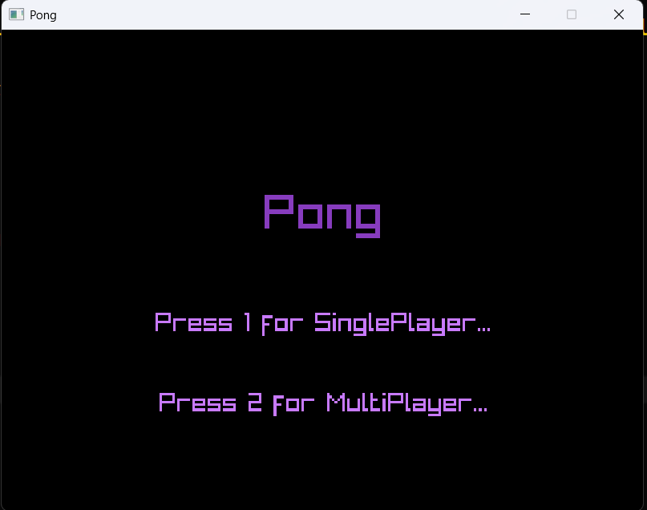
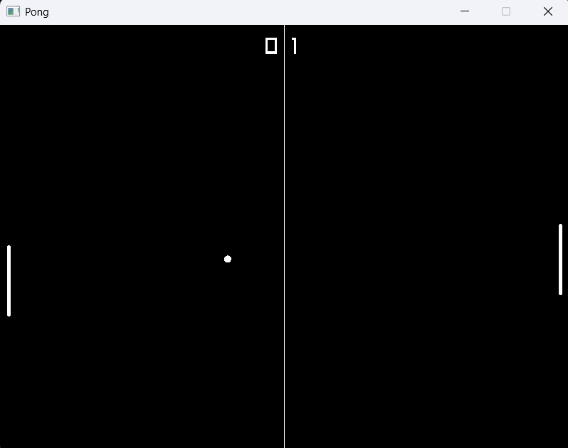
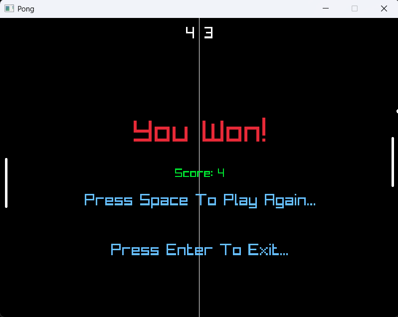

# Pong Clone

A Pong clone written in C++ using raylib.

## Screenshots

### Title Screen


### Gameplay


### Win Screen


## Requirements

- Visual Studio 2022 (or newer)
- Premake5
- Windows

## Building

1. Clone the repository.
2. Run:

```bat
GenerateProjects.bat
```

3. Open `Pong.slnx`.
4. Build the `Application` project.
5. Press F5.

## Running

If you're using the prebuilt binary and receive missing DLL errors, install the latest Microsoft Visual C++ Redistributable (x64).
- **Windows Runtime:** [Microsoft Visual C++ Redistributable (x64)](https://learn.microsoft.com/en-us/cpp/windows/latest-supported-vc-redist)
- **Latest Release:** [Download Pong](https://github.com/MSh103/1.Pong/releases/latest)


## Third-party

- raylib (included in `Thirdparty/`)

Note: If raylib does not work download prebuilt binaries from the offical website.
https://github.com/raysan5/raylib/releases (I am using release 6.0)